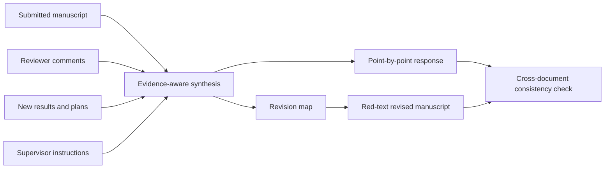

# Response Master

[](LICENSE)
[](SKILL.md)

**Response Master** is a Codex skill for scientific manuscript revision after peer review. It turns reviewer comments, new experimental results, planned changes, and supervisor instructions into a point-by-point response, an executable manuscript revision map, and an optional red-text revised manuscript.

**Response Master** 是一个用于科研论文投稿后返修的 Codex skill。它能够根据审稿意见、补充实验结果、计划修改内容和导师要求，生成逐条回复、可执行的稿件修改清单，以及可选的红字修改稿。

> Status: demo. The workflow and formatting rules were distilled from two comparatively complete internal revision packages. Every scientific claim and numerical result must still be checked by the authors before submission.

## What it produces / 输出内容

| Deliverable | Purpose |
| --- | --- |
| `*_point_by_point_response.docx` | Quotes every reviewer comment and drafts the corresponding response. |
| `*_manuscript_revision_map.docx` | Specifies exactly where, why, and how each manuscript change should be made. |
| `*_revised_red.docx` | Applies the approved map to the submitted manuscript and marks changed text in red. |

The revision map is designed as a handoff document. Another model should be able to apply it to the original manuscript without reconstructing the full drafting conversation.

## Workflow / 工作流



The skill supports three modes:

1. **Draft response and revision map** — use when reviewer comments and new results are available.
2. **Apply a revision map** — use when an approved map and the originally submitted manuscript are available.
3. **Full revision package** — produce and cross-check all three deliverables.

## Required inputs / 建议输入

- The originally submitted manuscript, including supplementary information when relevant.
- Complete editor and reviewer comments in their original order.
- New experimental or analytical results, even if they are still in scattered notes.
- Proposed changes and any supervisor-specific requirements.

A prewritten response and a pre-revised manuscript are not required. They are outputs of the workflow.

## Lab formatting conventions / 回复与红字格式

- Reviewer comments: black italic text.
- `REPLY:`: blue and bold.
- Response body: blue roman text.
- Revised text quoted inside the response: blue italic text in quotation marks.
- New or replacement text in the revised manuscript: pure red `#FF0000`.
- Unchanged manuscript text retains its original formatting.

Detailed conventions are defined in [`references/lab-style.md`](references/lab-style.md). The revision-map schema is defined in [`references/revision-map.md`](references/revision-map.md).

## Evidence safeguards / 科学内容边界

The skill separates supplied material into completed evidence, planned work, proposed wording, supervisor instructions, and unresolved items. It must not:

- describe a planned experiment as completed;
- invent data, sample sizes, statistics, figure numbers, locations, or citations;
- broaden a conclusion beyond the supplied evidence;
- silently omit a reviewer subrequest;
- claim that a response quotation matches the manuscript without checking it.

Unsupported requests should lead to a narrower claim, an explicit limitation, or an author-confirmation flag. See [`references/evidence-consistency.md`](references/evidence-consistency.md).

## Installation / 安装

Clone the repository into a project's `.agents/skills` directory:

```powershell
git clone https://github.com/GC-Zhang-Tomo/Response-Master.git .agents/skills/lab-reviewer-response
```

Open or restart the Codex project after installation. The skill is triggered by post-submission revision tasks that match the description in [`SKILL.md`](SKILL.md).

The optional template builder and output checker require Python and `python-docx`:

```powershell
python -m pip install -r requirements.txt
```

## Example request / 使用示例

```text
Use the lab-reviewer-response skill on this revision package.

Inputs:
- the originally submitted manuscript;
- the complete reviewer comments;
- our new experiments and analysis notes;
- the PI's additional requirements.

First produce a point-by-point response and a manuscript revision map.
Do not treat planned experiments as completed. Flag every unresolved value or
location for author confirmation. After the map is approved, apply it to the
original manuscript and mark only changed text in red.
```

## Repository structure / 仓库结构

```text
Response-Master/
├── SKILL.md
├── agents/
│   └── openai.yaml
├── assets/
│   ├── lab-response-template.docx
│   └── manuscript-revision-map-template.docx
├── references/
│   ├── evidence-consistency.md
│   ├── lab-style.md
│   └── revision-map.md
└── scripts/
    ├── build_templates.py
    └── check_outputs.py
```

`scripts/check_outputs.py` is a structural backstop for formatting, placeholders, and quote matching. It does not replace scientific review or rendered-page inspection.

## Data and privacy / 数据与隐私

This repository contains only general instructions, blank templates, and helper scripts. It does **not** contain the historical manuscripts, reviewer reports, unpublished experimental data, or response letters used to derive the style.

Keep real revision packages in a controlled working directory. Do not commit confidential manuscripts or unpublished data to this repository. The supplied `.gitignore` excludes the conventional `inputs/`, `outputs/`, and `work/` directories, but users remain responsible for checking every commit.

## Limitations / 当前限制

- The current demo was calibrated from two internal revision packages.
- It has not yet been validated against a large set of journals or article types.
- Automated checks cannot establish scientific correctness.
- Complex Word fields, Zotero citations, figures, and supplementary files still require final visual inspection.

## License

Licensed under the [Apache License 2.0](LICENSE). See [`NOTICE`](NOTICE) for attribution information.
