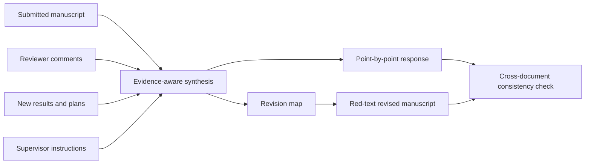

# Response Master

[](LICENSE)
[](SKILL.md)

**Response Master** is a Codex skill for scientific manuscript revision after peer review. It turns reviewer comments, new experimental results, planned changes, and supervisor instructions into a point-by-point response, an executable manuscript revision map, and an optional red-text revised manuscript.

**Response Master** 是一个用于科研论文投稿后返修的 Codex skill。它能够根据审稿意见、补充实验结果、计划修改内容和导师要求，生成逐条回复、可执行的稿件修改清单，以及可选的红字修改稿。

> Status: demo. The workflow was initially distilled from two internal revision packages, refined using a third package containing a response, baseline/revised manuscripts, a cover letter, and revised SI, and extended through three more response/revised-manuscript pairs. These examples are not independent scientific validation. Every claim and numerical result must still be checked by the authors before submission.

## What it produces / 输出内容

| Deliverable | Purpose |
| --- | --- |
| `*_point_by_point_response.docx` | Quotes every reviewer comment and drafts the corresponding response. |
| `*_manuscript_revision_map.docx` | Specifies exactly where, why, and how each manuscript change should be made. |
| `*_revised_red.docx` | Applies the approved map to the submitted manuscript and marks changed text in red. |

The revision map is designed as a handoff document. Another model should be able to apply it to the original manuscript without reconstructing the full drafting conversation.

## Workflow / 工作流



The skill supports three modes:

1. **Draft response and revision map** — use when reviewer comments and new results are available.
2. **Apply a revision map** — use when an approved map and the originally submitted manuscript are available.
3. **Full revision package** — produce and cross-check all three deliverables.

## Required inputs / 必需输入

Before drafting, the skill runs a mandatory intake gate in chat. It reports every required input as `Received`, `Incomplete`, or `Missing` and does not start the point-by-point response until all three required inputs are usable:

1. The exact originally submitted manuscript reviewed by the journal.
2. The complete reviewer comments, with the editor decision letter when available.
3. A coherent added-experiment evidence summary containing the concrete data, experimental conditions, and results intended to answer the reviewers.

The evidence summary must link concerns to completed/planned work, essential conditions, observed results, and their sources. Controls, sample sizes, and statistics are needed where they determine the interpretation of a key result or proposed claim. Usability is judged against the targeted reviewer concern, not an exhaustive new-study checklist. A current response draft may serve as the summary file when it contains the needed evidence information; its scientific assertions still need checking. A concern answered through existing evidence or clarification does not automatically require a new experiment.

首次为一个返修项目调用本 Skill 时，Codex 必须先在聊天中输出材料检查清单。送审稿件、完整审稿意见以及可用的证据汇总信息三项齐备后开始撰写 response。已有 response 草稿若已包含所需数据、关键条件和结果，可作为证据汇总文件；不因缺少与核心回复无关的完善材料而阻止起草。

The skill also recommends, without treating them as hard blockers:

- an author-written response draft or partial replies for the current round, including the first revision;
- a manuscript already revised against that draft, with revised SI/figures and tracked or red edits if available;
- Supplementary Information;
- new or revised figures, legends, tables, and source data;
- detailed methods, statistical outputs, and relevant references;
- journal decision and revision instructions;
- cover letter, if available;
- supervisor requirements and preferred response strategy;
- earlier response letters and revised manuscripts for later revision rounds.

A prewritten response and a pre-revised manuscript are optional, valuable references. The first checklist explicitly invites users to upload them or place them in the project folder. The skill preserves useful arguments and existing edits after verification, distinguishes the reviewed baseline from the working revision, and avoids losing or applying changes twice.

如果已经人工写过 response 初稿、部分回复，或已据此修改 manuscript，请一并上传或放入项目文件夹，并注明版本关系。首轮返修同样适用；这些是推荐参考材料，不是新增的必需文件。请同时保留送审原稿，以便核对本轮全部修改。

## Reply quality / 回复质量

- Begin substantive replies with brief, context-specific thanks or appreciation before the direct answer; courteous disagreement does not require conceding the reviewer's interpretation.
- Vary openings, second sentences, evidence presentation, transitions, and endings across the whole response. A final editorial pass checks repeated sentence patterns, not just identical words, while preserving technical terms and exact quotations.
- Organize complex replies around the reviewer's concern groups and order. Several experiments or a result and its limitation can belong under one point.
- Use key evidence to answer the actual concern. Separate essential gaps from optional strengthening; do not demand comprehensive new experiments merely for completeness.
- Explain how parallel experiments complement one another and end with a bounded shared conclusion. Keep material limitations, without turning every result into a list of what it cannot prove.

回复目标是用可信、针对性的证据回应审稿人的核心疑虑。分点跟随问题的逻辑，多项实验围绕共同回答衔接；真正影响结论的缺口仍需指出，额外完善建议留给作者选择。

写作立场是帮助作者有理有据地说服审稿人：突出优势、关键证据及其对 concern 的回应，避免反复主动承认与当前问题无关的不足。内部证据审查与对外 reply 分开；只保留直接涉及审稿问题或影响解释真实性的必要限制，并简洁说明，不让泛泛的自我否定主导回复。

整篇 response 还需进行句式检查：并排检查各条回复的前两句，并检查实验引入、过渡和结尾，避免只替换感谢语而沿用相同句型。表达随问题和证据自然变化，保持礼貌与说服力；科学术语、数据、审稿人原文和稿件精确引文不为求变化而改写。

Additional examples inform how to reconcile different assay readouts, explain the scope of targeted validations, keep simple corrections concise, and distinguish proof-of-concept findings from broader claims. Requested data depositions or other non-prose deliverables receive their own status. Temporary response-figure numbers must not replace final manuscript numbers inside exact quotations.

新增示范进一步补强了实验差异的解释、关键验证与研究范围的衔接、简单问题的简洁回答，以及回复引文与正式稿件图号的同步。示范中的重复表达、过强推断和未核实完成事项不作为可模仿规则。

## Lab formatting conventions / 回复与红字格式

- Reviewer comments: black italic text.
- `REPLY:`: blue and bold.
- Response body: blue roman text.
- Revised text quoted inside the response: blue italic text in quotation marks.
- New or replacement text in the revised manuscript: pure red `#FF0000`.
- Unchanged manuscript text retains its original formatting.

Detailed conventions are defined in [`references/lab-style.md`](references/lab-style.md). The revision-map schema is defined in [`references/revision-map.md`](references/revision-map.md).

## Evidence safeguards / 科学内容边界

The skill separates supplied material into completed evidence, planned work, proposed wording, supervisor instructions, and unresolved items. It must not:

- describe a planned experiment as completed;
- invent data, sample sizes, statistics, figure numbers, locations, or citations;
- broaden a conclusion beyond the supplied evidence;
- silently omit a reviewer subrequest;
- claim that a response quotation matches the manuscript without checking it.

Claims unsupported by the combined evidence should lead to an appropriately narrower claim, a material limitation, a reasoned alternative, or an author-confirmation flag. Useful but nonessential experiments remain optional author-facing advice. See [`references/evidence-consistency.md`](references/evidence-consistency.md).

## Handling substantive revision / 实质性返修

The skill now distinguishes editorial submission routes, tracks recurring concerns across reviewers, and propagates changes in central claims across the title, abstract, significance statement when present, body text, and figure legends. It also checks sample provenance, dose normalization, statistical units, and linked Results/Methods/figure/SI changes. See [`references/response-strategy.md`](references/response-strategy.md).

新增规则关注：回复是否真正回答质疑、核心结论是否全文同步收紧、样品制备和用途是否清楚、视野数与独立重复是否区分，以及新增实验是否同时落实到正文、方法、图表和补充材料。历史示例中的参数、科学结论和个别格式偏差不会自动成为其他论文的规则。

When SI or a cover letter is supplied, the skill checks the actual figures/tables, shared numerical values and units, and consistency of the title, editorial route, and enclosure list. A revised SI alone cannot establish what changed from its previous version. Cover-letter drafting is optional and must be requested.

提供 SI 和 cover letter 后，还会核对补充图表是否实际落实、正文与 SI 的数值和单位是否一致，以及投稿信中的标题、投稿性质和附件清单是否准确。Cover letter 和 SI 仍是推荐材料，不新增为第四、第五项硬性输入。

## Installation / 安装

Clone the repository into a project's `.agents/skills` directory:

```powershell
git clone https://github.com/GC-Zhang-Tomo/Response-Master.git .agents/skills/lab-reviewer-response
```

Open or restart the Codex project after installation. The skill is triggered by post-submission revision tasks that match the description in [`SKILL.md`](SKILL.md).

On first use for a revision package, invoke the skill and let it run the intake gate before asking it to draft:

```text
Use $lab-reviewer-response for this returned manuscript package.
First show the mandatory input checklist in chat. Do not draft the response until
the originally submitted manuscript, complete reviewer comments, and the
added-experiment evidence summary are all present and usable.
```

Installing a local skill does not itself send a chat message. The checklist appears when the skill is first invoked for a revision package.

### Updating an installed copy / 更新已安装副本

Publishing this repository does not update copies already cloned or downloaded onto other computers. This repository includes no automatic GitHub updater. For the project-local clone above, run from the project directory:

```powershell
git -C .agents/skills/lab-reviewer-response status --short
git -C .agents/skills/lab-reviewer-response pull --ff-only origin main
git -C .agents/skills/lab-reviewer-response log -1 --oneline
```

Inspect and preserve local modifications before pulling. If the installed folder was copied or downloaded without its own `.git`, back it up and replace the skill files from the current repository instead; do not run Git against an enclosing project by mistake. Use the actual installation path if different from the example.

Codex detects changes to local skill files automatically; if the updated skill does not appear, restart Codex ([official documentation](https://learn.chatgpt.com/docs/build-skills)). This local detection does not fetch new commits from GitHub. In an existing conversation that already read an older skill, explicitly ask it to reread the updated skill and relevant references before continuing.

同学可以直接对 agent 说：“请从 GC-Zhang-Tomo/Response-Master 更新本项目安装的 lab-reviewer-response，保留本地修改，核对版本，然后重新读取新版 SKILL.md 和相关 references。”只有实际更新了本地文件，才会用到发布的新规则；每次调用不会自动拉取 GitHub 最新版。

The optional template builder and output checker require Python and `python-docx`:

```powershell
python -m pip install -r requirements.txt
```

## Example request / 使用示例

```text
Use the lab-reviewer-response skill on this revision package.

Inputs:
- the originally submitted manuscript;
- the complete reviewer comments;
- our added-experiment evidence summary with concrete data, conditions, and results;
- our response draft and the manuscript already revised against it, if available
  (please preserve useful existing work and distinguish these from the reviewed baseline);
- the PI's additional requirements.

First show the mandatory intake checklist in chat. When all required inputs pass,
produce a point-by-point response and a manuscript revision map.
Do not treat planned experiments as completed. Flag every unresolved value or
location for author confirmation. After the map is approved, apply it to the
original manuscript and mark only changed text in red.
```

## Repository structure / 仓库结构

```text
Response-Master/
├── SKILL.md
├── agents/
│   └── openai.yaml
├── assets/
│   ├── lab-response-template.docx
│   └── manuscript-revision-map-template.docx
├── references/
│   ├── evidence-consistency.md
│   ├── lab-style.md
│   ├── response-strategy.md
│   └── revision-map.md
├── scripts/
│   ├── build_templates.py
│   └── check_outputs.py
└── tests/
    └── test_check_outputs.py
```

`scripts/check_outputs.py` is a structural backstop for formatting, placeholders, and quote matching. It searches standalone revision quotations inside `REPLY:` sections, including multi-paragraph passages, and reports unmatched or unclosed quotations. Revised SI files can be supplied with repeated `--supplement` arguments:

```powershell
python scripts/check_outputs.py --response response.docx --revision-map revision-map.docx --revised-manuscript revised.docx --supplement revised-si.docx
python -m unittest discover -s tests
```

Quote matching preserves case and units and normalizes whitespace only. Citation rendering can still cause a mismatch. Inline quotations, alternate reply labels, missing destination files, destination correctness, and scientific meaning require manual review. A successful exit does not certify readiness for submission or that every revision is red. The script does not replace scientific review or rendered-page inspection.

## Data and privacy / 数据与隐私

This repository contains only general instructions, blank templates, and helper scripts. It does **not** contain the historical manuscripts, reviewer reports, unpublished experimental data, or response letters used to derive the style.

Keep real revision packages in a controlled working directory. Do not commit confidential manuscripts or unpublished data to this repository. The supplied `.gitignore` excludes the conventional `inputs/`, `outputs/`, and `work/` directories, but users remain responsible for checking every commit.

## Limitations / 当前限制

- The current demo draws on six internal revision packages. The third package includes revised SI and a cover letter but lacks a separate original review letter and the baseline SI. The three subsequently added pairs contain responses and revised manuscripts, without separate reviewed baselines, original review letters, or standalone SI files in the supplied set. Their underlying raw data have not been independently verified, and some response quotations differ from the supplied revised files.
- It has not yet been validated against a large set of journals or article types.
- Automated checks cannot establish scientific correctness.
- Complex Word fields, Zotero citations, figures, and supplementary files still require final visual inspection.

## License

Licensed under the [Apache License 2.0](LICENSE). See [`NOTICE`](NOTICE) for attribution information.
